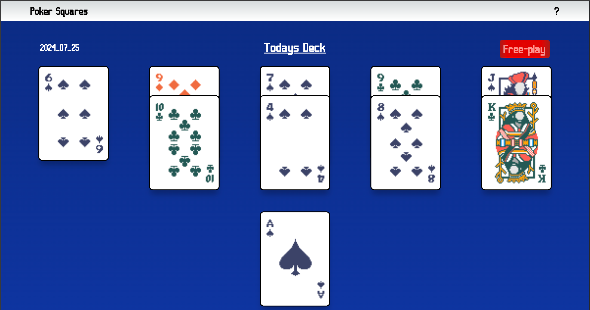
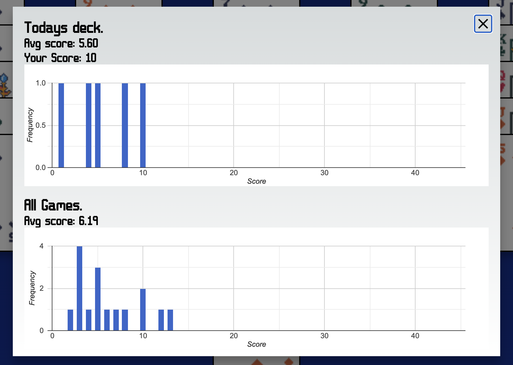
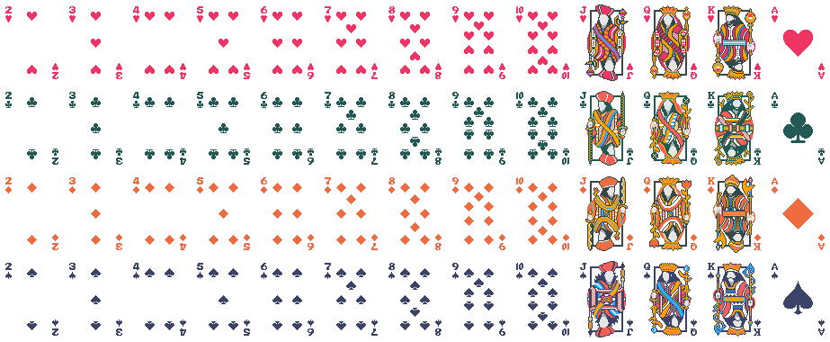

# Poker Squares

I played Poker Squares when I grew up and was reminded of it when visiting my parents this summer. Turns out all of the websites I could find to play it online was full of ads. So this repository hosts a simple poker squares playing game, with the added functionality to play the "daily deck" to compare with others, and free-play mode to play a randomly shuffled deck. Using [Vercel KV](https://vercel.com/docs/storage/vercel-kv) I was able to use Redis to persist scores, so I persist global games, as well as the daily deck game, viewable on the leaderboard.

### Credits

All the artwork comes from the very popular game [Balatro](https://www.playbalatro.com/), sourced from [spriters-resource](https://www.spriters-resource.com/pc_computer/balatro/). The font used is from [FontStruct](https://fontstruct.com/fontstructions/show/2326420/balatro). The rules are adapted from the swedish page for [pokerpatiens](https://sv.wikipedia.org/wiki/Pokerpatiens).

### Trivia

The app uses a bitwise way to score poker hands that I found online which was very fascinating, worth a read, see [A Poker hand analyzer in JavaScript using bit & mathematical operations](https://www.codeproject.com/Articles/569271/A-Poker-hand-analyzer-in-JavaScript-using-bit-math).

The sprites used are in a spritemap, which means you only load one image and re-use it by cropping it!

